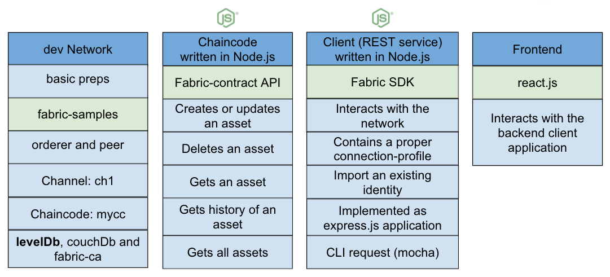

# Fabric Developer Starter Kit
This is a starter kit for Hyperledger Fabric Node.js Developers.

This guide consists of the following parts:

- [Part 1 - Preparation](#OS-preparation)
- [Part 2 - Using the development network](network/readme.md)
- [Part 3 - Set up and run a client application](backend/readme.md)
- Set up a react frontend application

## Short Overview of the Starter Kit


The slides from the presentation can be found [here](https://docs.google.com/presentation/d/1Maqwoc0X94_GD73R2wzIeUIunM6_n48T9yGbWeIYUjI/edit?usp=sharing).

## Part 1 - Preparation
These steps describe a HLF 2.2.x installation on e.g. a DigitalOcean Droplet. 

>Note: To interact from your windows machine with the droplet use putty.

## Droplet 
Digital Ocean Droplet, 1 CPU, 2 GB, 50 GB SSD  
OS, Ubuntu 20.04 (LTS) x64

## Access via ssh
ssh root@ip-of-the-host

## Basic Installation
The following steps are required to do a basic installation of the Droplet.
```bash
# update the OS
apt update && apt upgrade

# install some useful/required helpers
apt install tree jq gcc make g++

# it's always good the use the right time
# so setup the correct timezone
timedatectl set-timezone Europe/Vienna

# check the time
date

# restart the server, if needed
init 6
```

## Install Docker
The following steps are required to install Docker on the Droplet. Reference: https://docs.docker.com/engine/install/ubuntu/

```bash
# set up the repository
apt install \
  apt-transport-https \
  ca-certificates \
  curl \
  gnupg-agent \
  software-properties-common

# add Docker’s official GPG key
curl -fsSL https://download.docker.com/linux/ubuntu/gpg | sudo apt-key add -

# set up the stable repository
add-apt-repository \
  "deb [arch=amd64] https://download.docker.com/linux/ubuntu \
  $(lsb_release -cs) \
  stable"

# install docker engine
apt update
apt install docker-ce docker-ce-cli containerd.io

# check the docker version
docker --version
# > Docker version 20.10.7, build f0df350
```

## Install Docker-Compose
The following steps are required to install docker-compose on the Droplet. Reference: https://docs.docker.com/compose/install/

```bash
# install docker-compose
curl -L "https://github.com/docker/compose/releases/download/1.29.2/docker-compose-$(uname -s)-$(uname -m)" -o /usr/local/bin/docker-compose

# apply executable permissions to the binary
chmod +x /usr/local/bin/docker-compose

# check the docker-compose version
docker-compose --version
# > docker-compose version 1.29.2, build 5becea4c
```

## Install node.js
The following steps are required to install Node.js on the Droplet.

```bash
# add PPA from NodeSource
# supported versions of Node.js: '^10.15.3 || ^12.13.1 || ^14.13.1', npm: '^6.4.1' 
curl -sL https://deb.nodesource.com/setup_14.x -o nodesource_setup.sh

# call the install script
. nodesource_setup.sh

# install Node.js
apt-get install -y nodejs

# check the ready Node.js version
node -v
# > v14.17.1
```

## Create Basefolder
Starting from a base folder, in my case **/root**, we should end up with the following folder structure.

```bash
root@jsday:~/fabric 
tree -L 1
.
├── fabric-samples
└── fabricStarterKit
```

Create base folder and clone the starter kit.
```bash
pwd
# > /root

# create base folder
mkdir fabric

# make sure you are in the Fabric base folder
cd fabric

# clone the starter kit
git clone https://github.com/samlinux/fabricStarterKit.git
```

## Install Samples, Binaries and Docker Images
Hyperledger Fabric provides a script that will download and install samples and binaries to your system. We can use that.

```bash

# curl -sSL http://bit.ly/2ysbOFE | bash -s -- <fabric_version> <fabric-ca_version> <thirdparty_version>

# latest production ready release, omit all version identifiers
# curl -sSL https://bit.ly/2ysbOFE | bash -s

# we use 2.2 in our examples
curl -sSL https://bit.ly/2ysbOFE | bash -s -- 2.2.3 1.5.0

# check downloaded images
docker images

# add the fabric bin folder to the path
echo "export PATH=/root/fabric/fabric-samples/bin:$PATH" >> $HOME/.profile

# reload the .profile file
source $HOME/.profile

# check the bin cmd
peer version

```

## Try the Installation
The fabric-samples provisions a sample Hyperledger Fabric test-network consisting of two organizations, each maintaining one peer node. It will deploy also a single RAFT ordering service by default. 

To test your installation we can start interacting with the network. Let`s do a short test run.

```bash
# switch to the base folder
cd fabric-samples/test-network

# since there was a change to the docker-compose 1.29 we have to move one file to get the samples working (this should be fixed in upcoming versions)
mv .env docker/

# print some help
./network.sh --help

# bring up the network and create the default channel named mychannel
./network.sh up createChannel

# install default CC - asset-transfer (basic) chaincode
./network.sh deployCC -ccn basic -ccp ../asset-transfer-basic/chaincode-javascript -ccl javascript

# show if some containers are running
docker ps
docker-compose -f docker/docker-compose-test-net.yaml ps
```

### Some useful tmux commands

Before you start, get familiar with some tmux commands you are going to use.

>**start a new tmux session**<br>
tmux new -s fabric

>**attach to existing session**<br>
tmux att -t fabric

>**Create a new panel horizontally**<br> 
CTRL + b "

>**Switch/select panel by number**<br> 
CTRL + b q  0 ... 9

>**Detach from session**<br> 
CTRL + b d 

>**Show all sessions**<br> 
tmux ls

>**Delete/kill session dev**<br> 
tmux kill-ses -t mysession

>**Enable scrolling**<br> 
CTRL + b :set -g mouse on


### Test the Set-Up

```bash
# execute the env file, so we can switch between organizations
source scripts/envVar.sh

# use Org1 (1 = Org1, 2 = Org2)
setGlobals 1

# we need two more variables
# the path to the fabric core config files
export FABRIC_CFG_PATH=../config

# a helper variable for the channel-name
export CHANNEL_NAME=mychannel

# check env vars
printenv | grep CORE

# init the channel - ledger with some sample data
peer chaincode invoke -o localhost:7050 --ordererTLSHostnameOverride orderer.example.com --tls --cafile ${PWD}/organizations/ordererOrganizations/example.com/orderers/orderer.example.com/msp/tlscacerts/tlsca.example.com-cert.pem -C mychannel -n basic --peerAddresses localhost:7051 --tlsRootCertFiles ${PWD}/organizations/peerOrganizations/org1.example.com/peers/peer0.org1.example.com/tls/ca.crt --peerAddresses localhost:9051 --tlsRootCertFiles ${PWD}/organizations/peerOrganizations/org2.example.com/peers/peer0.org2.example.com/tls/ca.crt -c '{"function":"InitLedger","Args":[]}'

# > 2021-06-28 14:36:01.382 CEST [chaincodeCmd] chaincodeInvokeOrQuery -> INFO 001 Chaincode invoke successful. result: status:200

# query a list of assets
peer chaincode query -C mychannel -n basic -c '{"Args":["GetAllAssets"]}' | jq .
```
When you see the results, you can move on.

## Bring down the Network
```bash
./network.sh down
```

Next try is to start the starter kit and test with the CLI commands.

[Next](network/readme.md)


